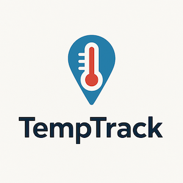

# TempTrack

A smart connected tracker that sends temperature-based alerts.

## Videos

You can learn how to build TempTrack yourself by watching the **Building a Connected Product with Notecard** YouTube series using the links below.

- [Part 1—Connecting Hardware](https://www.youtube.com/watch?v=dbzncnJwadE)
- [Part 2—Configuring Notecard](https://www.youtube.com/watch?v=RPH2FkGINWs)
- [Part 3—Writing Host Firmware](https://www.youtube.com/watch?v=5fb_mx91nOs)

## Hardware

The TempTrack project uses the following hardware.

- [Notecard Cell+WiFi](https://shop.blues.com/products/notecard-cell-wifi)
- [Notecarrier F](https://shop.blues.com/products/notecarrier-f)
- [Blues Cygnet](https://shop.blues.com/collections/feather-mcu/products/cygnet)
- [Adafruit BME280](https://www.adafruit.com/product/2652)
- [2000mAh Lithium Ion Battery](https://www.adafruit.com/product/2011)
- [Qwiic cable](https://www.adafruit.com/product/4210)

## Config

This project’s Notecard configuration lives in the [config.json](config.json) file. Learn about this configuration in the [Configuring Notecard](https://www.youtube.com/watch?v=RPH2FkGINWs) video.

## Firmware

This project’s host firmware lives in the [firmware](firmware) folder. Learn about this firmware and how to run it in the [Host Firmware]((https://www.youtube.com/watch?v=5fb_mx91nOs)) video.
